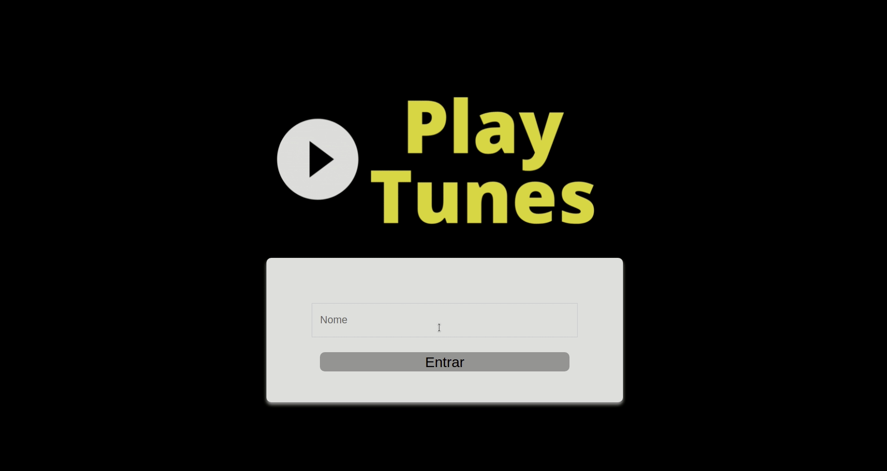
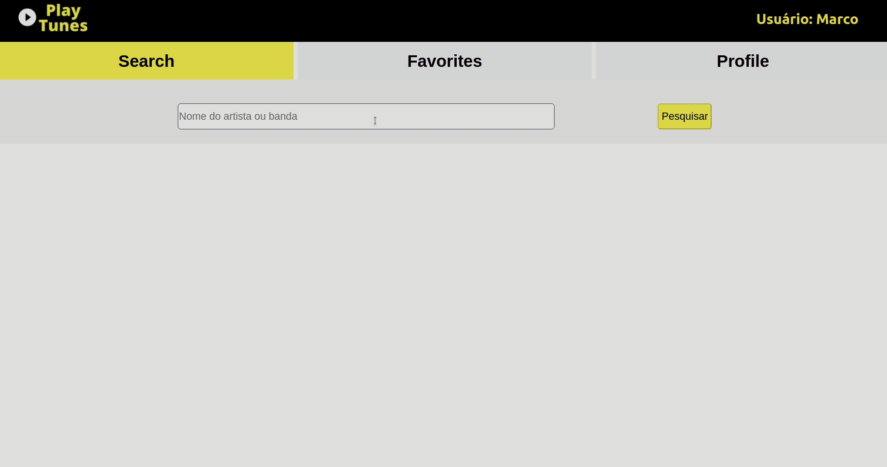
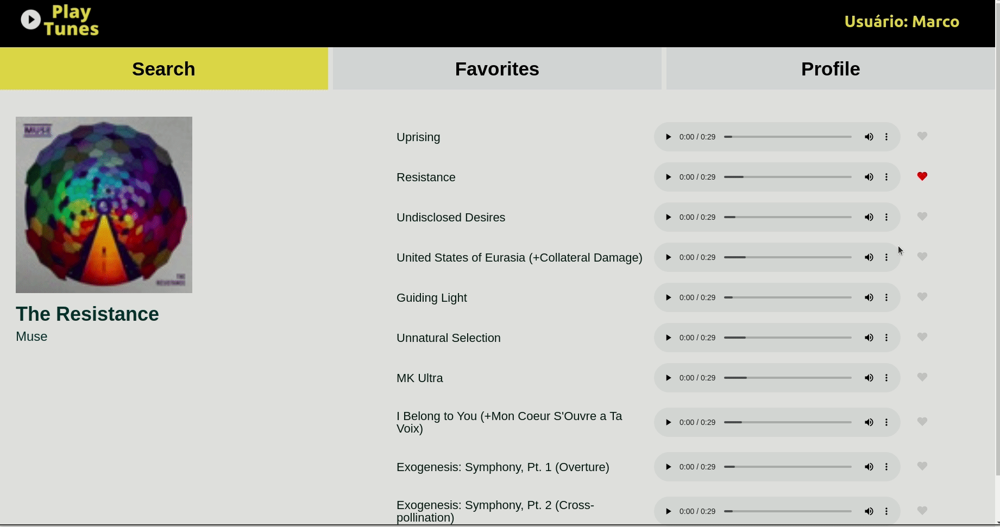
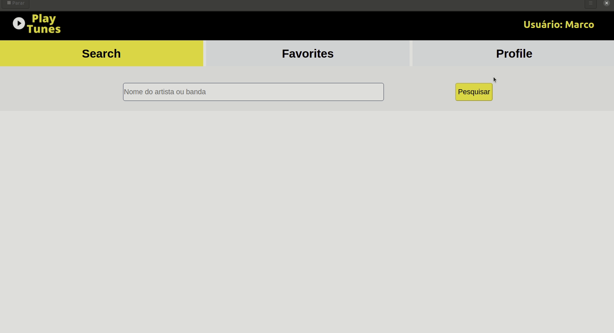

<h1 align="center">PlayTunes</h1>
<h4 align="center"> 
	🚧  PlayTunes 🚀 Finalizado  🚧
</h4>
<br>
<h2>Sobre</h2>
<p align="justify"> PlayTunes - É um player de música desenvolvido para que possa escutar e favoritar suas músicas preferidas. Podendo Escolher por album, banda ou cantor. Sendo sua lista de músicas  salvas localmente. Como a API do iTunes é uma amostra, podemos escutar apenas 30 segundos de cada música. Mas podendo escutar quantas vezes desejar. </p 

### Features

-  Cadastro de usuário
-  Pesquisa de músicas
-  Lista de músicas favoritas
-  lista salvas localmente
<br>
## 🛠 Tecnologias

As seguintes ferramentas foram utilizadas na construção do projeto:

- [React](https://pt-br.reactjs.org/)
- [JavaScript](https://developer.mozilla.org/en-US/docs/Web/JavaScript/Language_Resources)
- [Node.js](https://nodejs.org/en/)
- [RTL](https://testing-library.com/docs/react-testing-library/intro/)
- [Jest](https://jestjs.io/pt-BR/)
- [API-iTunes](https://developer.apple.com/library/archive/documentation/AudioVideo/Conceptual/iTuneSearchAPI/Searching.html#//apple_ref/doc/uid/TP40017632-CH5-SW1)

<h2>Testar o projeto</h2>
<h4>Clique na imagem abaixo</h4>
<br>
<div align="center">
<a  href="https://playtunes.herokuapp.com/" target="_blank"></a> 
</div>
<br>
<h2>Instalar o projeto em sua máquina</h2>
<br>
<h3>Pré-requisitos</h3>

Antes de começar, você vai precisar ter instalado em sua máquina as seguintes ferramentas:
[Git](https://git-scm.com) e [Node.js](https://nodejs.org/en/). É necessário a utilização de um editor de código, e como recomendação deixo o [VSCode](https://code.visualstudio.com/).


###  Rodando a aplicação web.

```bash
# Clone este repositório
$ git clone git@github.com:MarcoMecenasFilho/PlayTunes.git

# Acesse a pasta do projeto no seu terminal/cmd
$ cd PlayTunes

# Instale as dependências
$ npm install

# Execute a aplicação em modo de desenvolvimento
$ npm run dev

# A aplicação será aberta na porta:3000 - acesse http://localhost:3000
```
<h2>Utilizando a aplicação</h2>
<p align="justify">A tela inicial da aplicação é a página de login. Onde pode cadastrar seu nome de usuário  .</p>

<br>

<p align="justify">Quando efetuamos o Login, somos enviados para a página de pesquisa. Sendo muito simples sua utilização. Inserimos os dados que desejamos na barra de pesquisa e clicamos no botão de pesquisar. todos os albums encontrados, serão mostrados logo abaixo</p>

<br>

<p align="justify">Clicando no card desejado, somos redirecionados para a página daquele album. Onde temos informações da banda ou artista. E podemos ver e escutar as faixas de músicas(Lembrando que é uma API de demonstração, podemos escutar apenas 30s de cada faixa.)</p>

<br>
<p align="justify">Para favoritar as músicas, basta clicar no coração e depois ir para aba favorites. onde a lista de faixas favoritas são mostradas. Para excluir uma faixa, na aba favorites basta clicar no coração novamente.</p>

<br>
<p align="justify">Para visualizar ser perfil, basta clicar na aba profile. Inialmente só tera o seu nome, então clique no botão editar perfil, onde pode adicionar suas informações. Para adicionar uma novo imagem, basta inserir a url da mesma.</p>

<br>


## 📝 Licença

Este projeto foi feito com muita dedicação e carinho por Marco Mecenas  [Entre em contato!](https://www.linkedin.com/in/marcomecenasfilho/)
<p align="justify">Foi utilizado o projeto TrybeTunes como inspiração.  Sendo ele desenvolvido durante minha formação de desenvolvedor web FullStack na <a href="https://www.betrybe.com/" target="_blank">Trybe</a>.</p>
